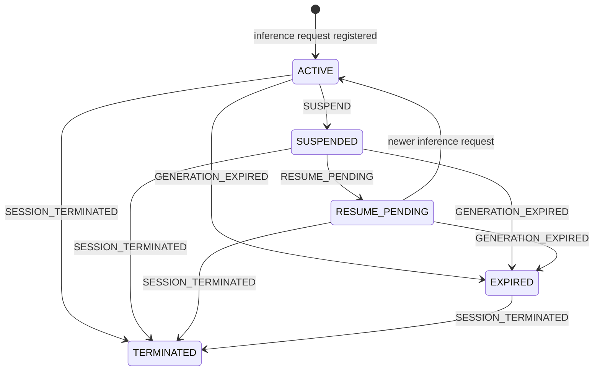
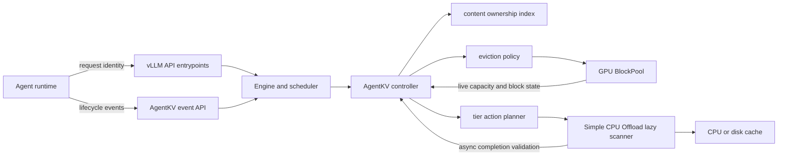

# AgentKV for vLLM

面向 Agent 工作负载的、应用感知的键值（Key-Value，KV）缓存生命周期管理实验。

> [!IMPORTANT]
> 这是基于 [vLLM 官方仓库](https://github.com/vllm-project/vllm)维护的实验性
> fork，不是 vLLM 官方发行版。项目目前用于协议验证、策略实验和上游合并前的工程验证，
> 尚不建议未经鉴权、压测和故障演练就直接投入生产环境。

## 项目概述

大型语言模型（Large Language Model，LLM）推理引擎通常只能看到请求、缓存块、
命中率和显存压力，却不知道一个 Agent 会话接下来要做什么。

例如，在一次工具调用开始后：

- 当前推理 generation 已经结束，但几秒后很可能继续；
- 某个会话已经永久结束，其缓存不再具有业务价值；
- 两个会话共享同一段前缀，其中一个结束并不代表共享缓存可以删除；
- 一个延迟到达的旧事件不应该覆盖新 generation 的状态；
- 图形处理器（Graphics Processing Unit，GPU）空间紧张时，不同生命周期的缓存不应该
  只按照最久未使用（Least Recently Used，LRU）顺序处理。

原生 vLLM 无法从请求本身推断这些业务事实。AgentKV 的目标是建立一条边界清晰的控制面：

1. 上游 Agent runtime 只报告稳定身份、generation 和生命周期事实；
2. vLLM 自己观察缓存哈希、引用计数、容量、驱逐压力和传输状态；
3. AgentKV 策略层组合两类信息，做出 `KEEP`、`OFFLOAD`、`DROP` 或原生回退决策；
4. 任何缺失、延迟、重复、无效或执行失败的信号都不能影响推理正确性。

本项目不是让上游直接控制物理缓存块，也不是把调度器变成 Agent 状态数据库。它是在业务
生命周期与 vLLM 资源管理之间建立一个最小、可验证、可降级的接口。

## 为什么需要这个 fork

我们希望回答以下工程问题：

- Agent runtime 最少需要向推理引擎透露哪些信息？
- generation、session 和 branch 应该如何定义，才能抵抗乱序与延迟事件？
- 业务身份如何安全地关联到 vLLM 的内容寻址缓存，而不依赖会复用的物理块标识符
  （Identifier，ID）？
- 共享缓存存在多个所有者时，应该如何避免误删？
- GPU 出现即时分配压力时，如何在不破坏原生分配语义的前提下优化驱逐顺序？
- 中央处理器（Central Processing Unit，CPU）或磁盘存在较低层缓存时，哪些块值得卸载？
- 异步卸载期间生命周期发生变化时，如何阻止过期动作污染低层缓存？
- AgentKV 未启用、策略报错或容量耗尽时，如何保证原生 vLLM 行为不变？

这些能力需要穿过入口协议、引擎调用、调度器、BlockPool 和 KV Connector 等多个层次，
因此目前以 vLLM fork 的形式完成端到端原型；接口稳定后，再拆分为适合提交上游的独立
拉取请求（Pull Request，PR）。

## 设计原则

### 1. 上游报告事实，vLLM 决定资源动作

上游可以表达“暂停”“即将恢复”“generation 失效”或“session 永久结束”，但不能指定：

- 删除哪个物理块；
- 把哪个块放到哪一张 GPU；
- 必须保留多少显存；
- 直接使用哪个缓存哈希；
- 绕过 vLLM 的容量、引用计数或隔离规则。

缓存动作始终由 vLLM 根据实时资源状态决定。

### 2. 内容寻址，不持久绑定物理 block ID

物理 block ID 属于分配器，释放后可以被其他请求复用。AgentKV 在请求结束前提取内容哈希，
以 `(namespace, session_id, branch_id, generation)` 作为逻辑所有者，维护内容哈希与
generation 之间的多对多关系。

执行动作前还会比较完整缓存键集合，避免旧计划作用到已经复用或别名发生变化的物理块。

### 3. 共享块采用“最保护的所有者”

一个缓存内容可能被多个 generation 或 session 共享。只要仍存在一个活跃或即将恢复的
所有者，该块就不能因为另一个所有者已经结束而被当作无价值数据。

### 4. 只处理已经空闲的缓存块

AgentKV 不会移动或删除仍被运行中请求引用的块。当前策略只评估已经位于 free queue、
本来就具备原生驱逐资格的缓存块。

### 5. 比较、校验、再执行

动作携带策略版本、完整缓存键、内容哈希和所有者 generation。执行前重新读取块快照，
异步卸载完成后再次询问控制器。状态或所有权发生变化时，旧结果不会进入低层缓存。

### 6. 默认保持原生行为

以下情况都会安全回退到 vLLM 原生逻辑：

- 请求没有提供 AgentKV 元数据；
- 当前没有任何 AgentKV 缓存所有者；
- 未配置兼容的 lazy offload connector；
- 策略回调抛出异常或返回无效计划；
- 动作的缓存键、内容哈希或物理块状态不再匹配；
- 低层缓存没有可分配容量。

## 核心概念

### Session

`session_id` 表示一个稳定、不可猜测的 Agent 会话身份。它不应该使用用户输入、提示词或
其他敏感文本，也不应该在不同租户之间复用。

### Namespace

`namespace` 是可信的租户或隔离域。生产部署中应由经过认证的 gateway 注入或校验，不能
允许不可信客户端任意选择其他租户的 namespace。

### Branch

`branch_id` 表示同一 session 下独立推进的一条逻辑分支，默认值为 `main`。不同 branch
拥有彼此独立的 generation 序列。

### Generation

`generation` 表示 `(namespace, session_id, branch_id)` 下的一次逻辑推理及其产生的缓存
快照。它必须从 `1` 开始使用正整数，并在同一 branch 内单调递增。

generation 不是全局版本号，也不是每个模型实例共享的计数器。例如：

```text
tenant-a / session-42 / main / generation 7  -> 暂停，等待工具结果
tenant-a / session-42 / main / generation 8  -> 工具结果返回后恢复并完成推理
```

如果 generation 8 已经成为当前 generation，之后才到达针对 generation 7 的延迟
`SUSPEND`，该事件会返回 `stale_generation`，不能把 generation 8 改回暂停状态。

`SESSION_TERMINATED` 是 session 级事件，会终止该 session 的所有 branch；其语义不受
某一个旧 generation 限制。

### Event sequence

`event_sequence` 在一个 session 内单调递增，并跨 branch 排序。它用于识别传输乱序。
`event_id` 用于支持至少一次投递下的幂等去重。

## 上游 Agent 接口契约

### 推理请求元数据

启用 AgentKV 的推理请求需要提供以下信息：

| 字段 | HTTP（Hypertext Transfer Protocol，超文本传输协议）Header | 必需 | 约束 |
| --- | --- | --- | --- |
| Session | `X-Session-ID` | 是 | 稳定、非空、不超过 256 个字符 |
| Namespace | `X-AgentKV-Namespace` | 是 | 可信隔离域，非空，不超过 256 个字符 |
| Generation | `X-AgentKV-Generation` | 是 | branch 内单调递增的正整数 |
| Branch | `X-AgentKV-Branch-ID` | 否 | 默认 `main`，非空，不超过 256 个字符 |
| Protocol version | `X-AgentKV-Protocol-Version` | 否 | 当前只接受 `1` |

示例：

```bash
curl http://localhost:8000/v1/chat/completions \
  -H 'Content-Type: application/json' \
  -H 'X-Session-ID: session-opaque-123' \
  -H 'X-AgentKV-Namespace: tenant-opaque-17' \
  -H 'X-AgentKV-Generation: 7' \
  -H 'X-AgentKV-Branch-ID: main' \
  -d '{
    "model": "your-model",
    "messages": [{"role": "user", "content": "hello"}]
  }'
```

非 HTTP 调用可以通过 `vllm_xargs` 提供等价字段：

- `agent_kv_namespace`
- `agent_kv_generation`
- `agent_kv_branch_id`
- `agent_kv_protocol_version`

`session_id` 继续使用 vLLM 请求已有的 session 字段或 `X-Session-ID`。Header 的值优先于
`vllm_xargs`。完全没有 AgentKV 字段的请求保持原生行为；只提供一部分身份字段会被拒绝，
避免静默关联到错误的 generation。

当前元数据已贯通 Chat Completions、Completions、Responses、batch serving、beam search、
同步与异步 engine 调用链。

### 生命周期事件

开发模式下提供以下应用程序编程接口（Application Programming Interface，API）：

```http
POST /v1/agent-kv/events
Content-Type: application/json
```

启动开发端点需要设置：

```bash
export VLLM_SERVER_DEV_MODE=1
```

协议版本 1 支持四种事件：

| 事件 | 作用域 | 含义 |
| --- | --- | --- |
| `SUSPEND` | Generation | 当前暂时不需要继续推理，缓存可以根据压力考虑卸载 |
| `RESUME_PENDING` | Generation | 很快将继续推理，应尽量保留 GPU 缓存 |
| `GENERATION_EXPIRED` | Generation | 该 generation 已经失去业务所有者 |
| `SESSION_TERMINATED` | Session | 整个 session 永久结束，所有 branch 均终止 |

事件示例：

```bash
curl http://localhost:8000/v1/agent-kv/events \
  -H 'Content-Type: application/json' \
  -d '{
    "protocol_version": 1,
    "event_id": "event-opaque-456",
    "event_sequence": 18,
    "event_type": "SUSPEND",
    "emitted_at_ms": 1786339200000,
    "namespace": "tenant-opaque-17",
    "session_id": "session-opaque-123",
    "branch_id": "main",
    "generation": 7,
    "hints": {
      "expected_resume_in_ms": 5000,
      "priority": 2,
      "retain_for_ms": 120000,
      "prefetch_allowed": true
    },
    "reason": "tool"
  }'
```

返回示例：

```json
{
  "protocol_version": 1,
  "event_id": "event-opaque-456",
  "status": "accepted",
  "accepted": true,
  "current_generation": 7,
  "current_state": "SUSPENDED",
  "last_event_sequence": 18
}
```

可能的 `status`：

| Status | 含义 |
| --- | --- |
| `accepted` | 事件通过校验并更新状态 |
| `duplicate` | `event_id` 已经处理过，本次为幂等重试 |
| `stale_event` | `event_sequence` 落后于 session 已接受的序列 |
| `stale_generation` | 事件试图修改已经落后的 generation |
| `session_terminated` | session 已经永久终止，后续状态变化被拒绝 |

### 可选业务 hints

| 字段 | 约束 | 当前作用 |
| --- | --- | --- |
| `expected_resume_in_ms` | 非负整数 | 用于驱逐排序中的恢复紧迫度提示 |
| `priority` | `0` 到 `3` | 在相同生命周期状态下细化保留优先级 |
| `retain_for_ms` | 非负整数 | 在期限内把暂停块视为 `KEEP` |
| `prefetch_allowed` | Boolean（布尔值） | 已进入协议，主动预取尚未实现 |
| `reason` | 最长 64 个字符 | 用于描述如 `tool`、`approval` 等暂停原因，不直接强制资源动作 |

hints 只表达业务意图，不是资源命令。即使上游提供 `retain_for_ms`，vLLM 也不承诺固定
显存配额或绝对保留。

### 上游不应该发送的信息

AgentKV 接口禁止或不需要上传：

- prompt 原文或模型输出；
- 工具参数、工具结果或用户隐私数据；
- GPU、CPU 或磁盘物理 block ID；
- vLLM 内部缓存哈希或完整缓存键；
- 强制删除、强制驻留或指定设备编号；
- 基于客户端自报的跨租户 namespace。

## 生命周期与动作语义

### 状态机



### GPU 即时驱逐顺序

当一次分配将覆盖 free queue 中的缓存块时，AgentKV 才介入排序。默认保护顺序从高到低为：

```text
RESUME_PENDING
ACTIVE
SUSPENDED
原生无所有者缓存
EXPIRED / TERMINATED
```

换句话说，真正选择驱逐目标时会优先处理 `EXPIRED` 和 `TERMINATED`，然后保持原生无所有者
缓存，再考虑暂停缓存，最后才触碰即将恢复或仍活跃的缓存。

相同策略得分保持原生 LRU 相对顺序。`priority`、有效的 `retain_for_ms` 以及更近的预计恢复
时间只用于细化同类候选项。

### Lazy 分层缓存动作

当 `SimpleCPUOffloadConnector` 配置为 `lazy_offload=true` 时，软压力扫描会为每个候选块
生成以下动作：

| 最保护所有者状态 | 动作 | 当前实现效果 |
| --- | --- | --- |
| `ACTIVE` | `KEEP` | 不创建低层副本，依靠 GPU 驱逐策略延后覆盖 |
| `RESUME_PENDING` | `KEEP` | 不创建低层副本，优先保留在 GPU |
| `SUSPENDED` 且 `retain_for_ms` 未到期 | `KEEP` | 到期后自动重扫并重新决策 |
| `SUSPENDED` | `OFFLOAD` | 容量允许时异步复制到 CPU 或磁盘层 |
| 所有者全部 `EXPIRED` 或 `TERMINATED` | `DROP` | 不创建低层副本，物理删除仍由原生分配触发 |
| 没有 AgentKV 所有者 | `DEFAULT` | 完整保留 Simple CPU Offload 原生行为 |

`KEEP` 是保留偏好，不是容量预留；`DROP` 是禁止产生新的低层副本，不是立即删除命令；
`OFFLOAD` 也不会阻塞推理等待低层空间。

## 系统架构



主要代码位置：

| 模块 | 责任 |
| --- | --- |
| [`vllm/v1/agent_kv/protocol.py`](vllm/v1/agent_kv/protocol.py) | wire-safe 类型、字段约束、事件与状态枚举 |
| [`vllm/v1/agent_kv/ownership.py`](vllm/v1/agent_kv/ownership.py) | 内容哈希与 generation 的多对多所有权索引 |
| [`vllm/v1/agent_kv/controller.py`](vllm/v1/agent_kv/controller.py) | session、branch、generation 状态和策略版本管理 |
| [`vllm/v1/agent_kv/policy.py`](vllm/v1/agent_kv/policy.py) | 纯函数形式的 GPU 驱逐规划 |
| [`vllm/v1/agent_kv/action.py`](vllm/v1/agent_kv/action.py) | `KEEP/OFFLOAD/DROP/DEFAULT` 分层动作规划 |
| [`vllm/v1/core/block_pool.py`](vllm/v1/core/block_pool.py) | free cache 快照、动作前精确校验和驱逐重排 |
| [`vllm/v1/simple_kv_offload/manager.py`](vllm/v1/simple_kv_offload/manager.py) | lazy store 接入、容量处理和异步结果重校验 |
| [`docs/features/agent_kv.md`](docs/features/agent_kv.md) | 协议级参考文档 |

## 关键安全机制

### 乱序与重复事件

- 同一 `event_id` 重复投递返回 `duplicate`；
- 落后的 `event_sequence` 返回 `stale_event`；
- 落后 generation 的状态迁移返回 `stale_generation`；
- session 终止后不接受新的生命周期迁移。

### 物理块复用

策略不保存长期物理 block ID 关系。每次动作都带有计划时的完整缓存键，BlockPool 在修改
free queue 或发起 store 前重新比较实时快照。

### 共享所有权

内容哈希可以对应多个 generation。策略对共享块选择最保护的有效 owner，避免一个结束会话
错误删除另一个活跃会话仍需使用的公共前缀。

### 异步卸载竞态

`OFFLOAD` 和 AgentKV 激活期间产生的 `DEFAULT` store 会记录当时的动作。数据复制完成时，
connector 再次向控制器校验当前 owner 集合和动作类型。如果期间发生恢复、终止、owner 变化
或缓存身份变化，复制结果不会注册为可命中的低层缓存，只会释放传输引用。

### 状态变化后的重扫

控制器每次接受影响策略的请求或事件都会递增 policy revision。lazy scanner 发现 revision
变化后重置 cursor，因此先前因 `KEEP` 跳过的块在变为 `SUSPENDED` 后仍能被重新评估。
`retain_for_ms` 到期也会触发相同的重扫机制。

### 有界元数据

当前控制器对状态持有设置了边界：

- 默认最多保留 100,000 个 session；
- 每个 branch 默认最多保留 16 个非活跃历史 generation；
- 每个 session 最多记录 256 个近期 `event_id` 用于去重；
- 仍有运行请求的 generation 不会因为历史窗口而被裁剪。

达到 session 上限时使用有界的最近使用顺序回收控制面元数据，并同步移除相关内容所有权。

## 启动方式

### 1. 获取本 fork

```bash
git clone https://github.com/lululuyuanyuanyuanGe/vllm.git
cd vllm
git checkout agent-kv/lifecycle-protocol
```

### 2. 按 vLLM 官方方式构建

不同 GPU、驱动和平台的构建方式不同，请先遵循
[vLLM 官方源码安装文档](https://docs.vllm.ai/en/latest/getting_started/installation/gpu/index.html)。

开发环境推荐使用 [`uv`](https://docs.astral.sh/uv/) 管理依赖，不要把系统 Python 环境当作
项目环境。

### 3. 启用 prefix cache 与 lazy offload

```bash
export VLLM_SERVER_DEV_MODE=1

vllm serve your-model \
  --enable-prefix-caching \
  --kv-transfer-config '{
    "kv_connector": "SimpleCPUOffloadConnector",
    "kv_role": "kv_both",
    "kv_connector_extra_config": {
      "cpu_bytes_to_use": 8589934592,
      "lazy_offload": true
    }
  }'
```

说明：

- `cpu_bytes_to_use` 是整个服务的 host memory 预算，connector 会按 world size 分配到各 rank；
- 也可以使用 `cpu_bytes_to_use_per_rank` 显式覆盖每个 rank 的容量；
- `kv_offload_backend` 默认为 `cpu`，也可以按 Simple CPU Offload 的已有配置使用 `disk`；
- AgentKV 的分层动作目前只接入 lazy 模式；eager 模式保持原生行为；
- 即使配置 connector，没有 AgentKV owner 时仍执行原生 lazy offload。

## 已完成的实施阶段

### Phase 1：生命周期协议与调用链

- 定义版本化 request metadata 与 lifecycle event；
- 支持 HTTP Header 和 `vllm_xargs`；
- 打通入口、同步与异步 engine、core client 和 scheduler；
- 实现开发模式 lifecycle endpoint；
- 实现幂等、序列校验、generation 隔离和 session 终止语义；
- 请求结束前捕获内容哈希所有权。

### Phase 2：应用感知的 GPU 驱逐

- 建立内容哈希到 generation 的多对多索引；
- 对空闲缓存块生成不可变快照；
- 仅在实际分配将覆盖缓存块时调用策略；
- 按生命周期、保留窗口、priority 和恢复紧迫度调整候选顺序；
- 保持相同得分下的原生 LRU 顺序；
- 对完整缓存键做 compare-and-validate；
- 规划失败时回退原生分配顺序。

### Phase 3：生命周期驱动的 lazy 分层缓存

- 定义软压力、硬压力和版本化 cache action；
- 实现 `DEFAULT/KEEP/OFFLOAD/DROP`；
- 接入 `SimpleCPUOffloadConnector` 和 `MultiConnector`；
- 保留 AgentKV 未激活时的原生 lazy path；
- 实现共享 owner 的最保护规则；
- 实现 retain deadline 与 policy revision 驱动的 cursor 重扫；
- 实现异步 store 完成时的动作重新校验；
- 对容量不足、策略异常和无效计划做安全处理。

## 当前测试状态

本分支最近一次定向验证结果：

- AgentKV 协议、所有权、控制器、驱逐与动作测试：`36 passed`；
- Simple CPU Offload scheduler 完整回归：`34 passed`；
- Ruff 静态检查通过；
- Ruff 格式检查通过；
- `git diff --check` 通过；
- Python compileall 通过。

在完整 vLLM 开发环境中可以运行：

```bash
pytest -q tests/v1/agent_kv
pytest -q tests/v1/simple_kv_offload/test_scheduler.py
```

执行静态检查：

```bash
uvx ruff check vllm/v1/agent_kv tests/v1/agent_kv
uvx ruff format --check vllm/v1/agent_kv tests/v1/agent_kv
git diff --check
```

定向单元测试只能证明策略和集成路径符合当前设计，不替代真实模型、真实 GPU、长时间压力、
多 worker、进程故障和跨节点部署测试。

## 当前限制

- 生命周期 endpoint 仅在 `VLLM_SERVER_DEV_MODE=1` 下提供；
- endpoint 尚未内置生产级身份认证、授权、限流和审计；
- 分层动作只接入 `SimpleCPUOffloadConnector` 的 lazy 模式；
- 当前没有主动预取；`prefetch_allowed` 只是前向兼容的业务 hint；
- `KEEP` 不预留固定 GPU 容量，也不保证永不驱逐；
- `DROP` 不主动扫描并立即删除块，只阻止创建新的低层副本；
- AgentKV 只决定是否向低层 admission，低层内部 victim 仍使用 connector 原生策略；
- 当前没有 Prometheus 指标和正式的低基数统计面板；
- data parallel 部署还没有 session-affine routing；
- controller 状态当前在 scheduler 进程内存中，不是跨实例持久化控制面；
- 服务重启后上游需要通过新请求和事件重新建立所需状态；
- 尚未完成官方 vLLM 全量测试矩阵和真实生产 workload benchmark。

## 路线图

### 下一步：可观测性与安全开关

计划优先增加低基数指标，且禁止把 session、event、branch 或 request 身份放入
Prometheus label：

- lifecycle event 的接收、接受、重复和过期数量；
- `DEFAULT/KEEP/OFFLOAD/DROP` 动作数量；
- offload 成功、异步失效、容量不足和原生回退数量；
- policy revision 变化和 cursor 重扫次数；
- 当前 session、generation、owner hash 和在途 store 的聚合数量；
- 未启用 AgentKV 时的调度开销基线。

同时增加显式实验开关、配置校验和生产端点保护方式。

### 然后：端到端与性能验证

- 从 HTTP 请求身份到 cache ownership 的端到端测试；
- `SUSPEND -> OFFLOAD -> cache hit load` 完整流程；
- 延迟 `RESUME_PENDING`、终止和共享 owner 竞态；
- CPU 容量耗尽、connector reset 和 worker failure；
- `MultiConnector`、多 cache group 和不同 block size；
- AgentKV 关闭与开启时的 scheduler latency、吞吐和命中率对比；
- 长 session、高频事件和 session 上限回收压力测试。

### 上游接口评审

完成可观测性与基准后，向 vLLM 上游提交 Draft PR（Draft Pull Request，草稿拉取请求），
优先评审以下边界：

- request metadata 是否属于通用 engine contract；
- lifecycle event 是否应使用开发 endpoint、内部接口或独立插件；
- connector 的 action policy binding 是否足够通用；
- BlockPool snapshot 与 planner callback 是否适合上游；
- AgentKV 是否应该作为内置实验功能、可选插件或独立扩展。

### 后续研究：主动预取

只有在观测和安全闭环完成后，才考虑利用 `RESUME_PENDING` 与 `prefetch_allowed` 主动把缓存
从 CPU 或磁盘加载回 GPU。预取会涉及 GPU block 预分配、取消、调度公平性、错误恢复和
多租户配额，风险明显高于当前的被动保留与卸载，不属于现阶段已实现能力。

## 与 vLLM 上游的关系

本仓库基于 [vllm-project/vllm](https://github.com/vllm-project/vllm) 开发，保留 vLLM 的
全部核心能力、贡献规范、许可证和原作者版权。

Git remote 建议保持：

```text
origin   -> https://github.com/lululuyuanyuanyuanGe/vllm.git
upstream -> https://github.com/vllm-project/vllm.git
```

AgentKV 改动集中在独立模块和少量窄接口中，目标是：

- 不改变无 AgentKV metadata 请求的行为；
- 不长期 fork 通用 vLLM 逻辑；
- 尽可能使用纯策略函数和最小 callback 接口；
- 把协议、BlockPool 通用能力、connector 接入和可观测性拆成可审核的提交；
- 持续同步 upstream，尽早发现 scheduler 与 connector 接口冲突。

本 fork 的当前开发分支是：

```text
agent-kv/lifecycle-protocol
```

## 开发与贡献

提交改动前至少应完成：

1. 阅读根目录 [`AGENTS.md`](AGENTS.md) 和 vLLM 官方贡献文档；
2. 确认改动不会绕过引用计数、free queue 或 connector transfer 生命周期；
3. 为乱序、重复、共享 owner、物理块复用和异步状态变化补充测试；
4. 验证 AgentKV 未激活时的原生行为；
5. 使用 `uv` 环境运行测试和 Ruff；
6. 由提交者本人理解、审阅并能够解释最终代码。

推荐的 commit 划分：

- 协议与 engine plumbing；
- 通用 BlockPool snapshot 或 callback；
- 纯 policy；
- connector integration；
- tests、metrics 和 docs。

不要在指标 label、日志或错误信息中输出高基数或敏感的 session、event、branch、request、
prompt、tool argument 和 tool result 内容。

## 参考文档

- [AgentKV 协议说明](docs/features/agent_kv.md)
- [vLLM 官方文档](https://docs.vllm.ai)
- [vLLM 官方安装指南](https://docs.vllm.ai/en/latest/getting_started/installation.html)
- [vLLM 官方贡献指南](https://docs.vllm.ai/en/latest/contributing/index.html)
- [PagedAttention 论文](https://arxiv.org/abs/2309.06180)

## 许可证与致谢

本项目沿用 vLLM 的 Apache License 2.0，详见 [`LICENSE`](LICENSE)。原始 vLLM 由
加州大学伯克利分校 Sky Computing Lab 发起，并由 vLLM 社区持续维护。本 fork 中未修改
部分的著作权和贡献归其各自作者所有。

如果在研究中使用 vLLM，请引用官方论文：

```bibtex
@inproceedings{kwon2023efficient,
  title={Efficient Memory Management for Large Language Model Serving with PagedAttention},
  author={Woosuk Kwon and Zhuohan Li and Siyuan Zhuang and Ying Sheng and
          Lianmin Zheng and Cody Hao Yu and Joseph E. Gonzalez and
          Hao Zhang and Ion Stoica},
  booktitle={Proceedings of the ACM SIGOPS 29th Symposium on Operating Systems Principles},
  year={2023}
}
```
