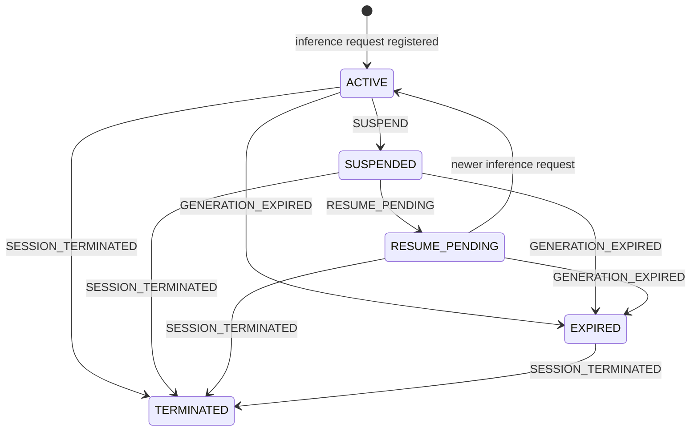
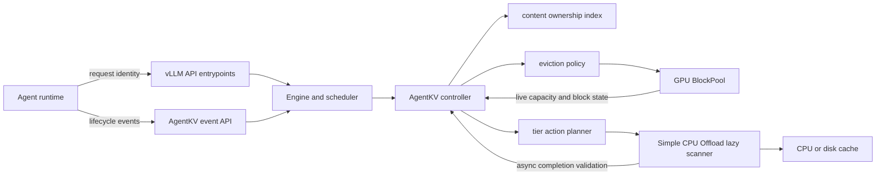

# AgentKV for vLLM

[中文](README.md) | [English](README_EN.md)

Application-aware Key-Value (KV) cache lifecycle management for agent workloads.

> [!IMPORTANT]
> This is an experimental fork of the
> [official vLLM repository](https://github.com/vllm-project/vllm), not an
> official vLLM release. It currently exists for protocol validation, policy
> experiments, and engineering verification before upstream review. Do not
> deploy it directly to production without authentication, load testing, and
> failure drills.

## Project overview

A Large Language Model (LLM) inference engine can observe requests, cache
blocks, hit rates, and memory pressure, but it does not know what an agent
session intends to do next.

For example, after an agent starts a tool call:

- the current inference generation has finished, but another inference is
  likely within a few seconds;
- a session may have permanently ended, making its cache valueless;
- two sessions may share the same prefix, so ending one session must not
  invalidate data still owned by the other;
- a delayed event for an old generation must not overwrite the state of a
  newer generation;
- under Graphics Processing Unit (GPU) pressure, caches with different
  lifecycles should not be treated solely by Least Recently Used (LRU) order.

Native vLLM cannot infer these business facts from an inference request alone.
AgentKV introduces a narrow control-plane boundary:

1. The upstream agent runtime reports only stable identity, generation, and
   lifecycle facts.
2. vLLM observes cache hashes, reference counts, capacity, eviction pressure,
   and transfer state.
3. The AgentKV policy combines both sources to choose `KEEP`, `OFFLOAD`,
   `DROP`, or native behavior.
4. Missing, delayed, duplicated, invalid, or failed signals must never affect
   inference correctness.

This project does not let the upstream runtime control physical cache blocks,
and it does not turn the scheduler into an agent-state database. It defines a
minimal, verifiable, and degradable interface between application lifecycle
facts and vLLM resource management.

## Why this fork exists

The project is intended to answer the following engineering questions:

- What is the minimum information an agent runtime must expose to an inference
  engine?
- How should session, branch, and generation be defined so that delayed and
  out-of-order events are safe?
- How can business identity be associated with vLLM's content-addressed cache
  without depending on reusable physical block identifiers?
- How should shared cache content with multiple owners be protected?
- How can eviction order be refined under immediate GPU allocation pressure
  without breaking native allocator semantics?
- When a lower Central Processing Unit (CPU) or disk tier exists, which blocks
  should be copied there?
- If lifecycle state changes during an asynchronous transfer, how can a stale
  action be prevented from polluting the lower-tier cache?
- How can native vLLM behavior remain unchanged when AgentKV is unused, the
  policy fails, or lower-tier capacity is exhausted?

These changes cross request entrypoints, engine calls, the scheduler,
`BlockPool`, and KV connectors. The end-to-end prototype therefore lives in a
vLLM fork today. Once the interfaces stabilize, the work can be separated into
reviewable upstream Pull Requests (PRs).

## Design principles

### 1. The upstream reports facts; vLLM chooses resource actions

The upstream runtime may report that a generation is suspended, likely to
resume, expired, or permanently terminated. It may not specify:

- which physical block to delete;
- which GPU should retain a block;
- how much device memory must be reserved;
- which internal cache hash to use;
- how to bypass vLLM capacity, reference-count, or isolation rules.

Resource actions remain vLLM decisions based on live engine state.

### 2. Content addressing, not persistent physical block identity

Physical block identifiers belong to the allocator and may be reused after a
block is released. Before request state is freed, AgentKV records content
hashes and associates them with a logical owner identified by:

```text
(namespace, session_id, branch_id, generation)
```

This produces a many-to-many relationship between content hashes and
generations. Before executing a plan, AgentKV also validates the complete
cache-key set so that a stale plan cannot act on a reused block or a block whose
aliases have changed.

### 3. Shared blocks use the most protective owner

The same content may be shared by multiple generations or sessions. As long as
one valid owner is active or about to resume, another owner's termination must
not make the shared block disposable.

### 4. Only already-idle cache blocks are evaluated

AgentKV does not move or delete blocks referenced by running requests. The
current policy evaluates only cached blocks already present in the free queue
and therefore already eligible for native eviction.

### 5. Compare, validate, then execute

Each action carries a policy revision, complete cache keys, content hashes, and
owner generations. The connector reads the live block snapshot before a store.
After an asynchronous store completes, it asks the controller to validate the
action again. A changed state or owner set makes the old result non-cacheable.

### 6. Native behavior is the default

AgentKV safely falls back to native vLLM behavior when:

- a request has no AgentKV metadata;
- there are no AgentKV cache owners;
- no compatible lazy-offload connector is configured;
- a policy callback raises an exception or returns an invalid plan;
- cache keys, content hashes, or physical block state no longer match;
- the lower tier has no allocatable capacity.

## Core concepts

### Session

`session_id` is a stable, opaque, and hard-to-guess agent-session identity. It
must not contain user input, prompts, or other sensitive text, and it must not
be reused across isolation boundaries.

### Namespace

`namespace` is a trusted tenant or isolation domain. In production, an
authenticated gateway should inject or validate it. An untrusted client must
not be allowed to select another tenant's namespace.

### Branch

`branch_id` identifies an independently advancing logical branch within a
session. Its default value is `main`. Each branch has its own generation
sequence.

### Generation

`generation` identifies one logical inference and its resulting cache snapshot
within `(namespace, session_id, branch_id)`. It is a positive integer starting
at `1` and must increase monotonically within a branch.

Generation is not a global version and is not shared across model instances.
For example:

```text
tenant-a / session-42 / main / generation 7  -> suspended for a tool result
tenant-a / session-42 / main / generation 8  -> resumed and completed
```

If generation 8 is already current and a delayed `SUSPEND` for generation 7
arrives later, the event receives `stale_generation`. It cannot return
generation 8 to a suspended state.

`SESSION_TERMINATED` is session-scoped and terminates every branch in the
session. Its meaning is not limited by a stale generation number.

### Event sequence

`event_sequence` increases monotonically across an entire session, including
all branches. It detects transport reordering. `event_id` provides idempotency
for at-least-once delivery.

## Upstream agent contract

### Inference request metadata

An inference request opting into AgentKV supplies the following identity:

The experimental feature must be explicitly enabled before server startup:

```bash
export VLLM_ENABLE_AGENT_KV=1
```

The default is `0`. With the switch disabled, requests without AgentKV fields
retain native vLLM behavior, while requests carrying AgentKV fields are
rejected so callers cannot mistakenly assume that lifecycle policy is active.

| Field | Hypertext Transfer Protocol (HTTP) header | Required | Constraint |
| --- | --- | --- | --- |
| Session | `X-Session-ID` | Yes | Stable, non-empty, at most 256 characters |
| Namespace | `X-AgentKV-Namespace` | Yes | Trusted isolation domain, at most 256 characters |
| Generation | `X-AgentKV-Generation` | Yes | Positive integer, monotonic within the branch |
| Branch | `X-AgentKV-Branch-ID` | No | Defaults to `main`, at most 256 characters |
| Protocol version | `X-AgentKV-Protocol-Version` | No | Currently only `1` is accepted |

Example:

```bash
curl http://localhost:8000/v1/chat/completions \
  -H 'Content-Type: application/json' \
  -H 'X-Session-ID: session-opaque-123' \
  -H 'X-AgentKV-Namespace: tenant-opaque-17' \
  -H 'X-AgentKV-Generation: 7' \
  -H 'X-AgentKV-Branch-ID: main' \
  -d '{
    "model": "your-model",
    "messages": [{"role": "user", "content": "hello"}]
  }'
```

Non-HTTP callers may provide the equivalent `vllm_xargs` fields:

- `agent_kv_namespace`
- `agent_kv_generation`
- `agent_kv_branch_id`
- `agent_kv_protocol_version`

`session_id` continues to use vLLM's existing session field or
`X-Session-ID`. Header values take precedence over `vllm_xargs`. A request with
no AgentKV-specific fields retains native behavior. A partially specified
AgentKV identity is rejected instead of being silently associated with the
wrong generation.

The metadata path currently covers Chat Completions, Completions, Responses,
batch serving, beam search, and synchronous and asynchronous engine calls.

### Lifecycle events

Development mode exposes this Application Programming Interface (API):

```http
POST /v1/agent-kv/events
Content-Type: application/json
```

Enable both the experimental feature and the development endpoint with:

```bash
export VLLM_ENABLE_AGENT_KV=1
export VLLM_SERVER_DEV_MODE=1
```

Protocol version 1 supports four lifecycle events:

| Event | Scope | Meaning |
| --- | --- | --- |
| `SUSPEND` | Generation | Inference is temporarily idle; cache may be offloaded under pressure |
| `RESUME_PENDING` | Generation | Another inference is expected soon; GPU retention is preferred |
| `GENERATION_EXPIRED` | Generation | The generation no longer has a business owner |
| `SESSION_TERMINATED` | Session | The entire session has permanently ended |

Example event:

```bash
curl http://localhost:8000/v1/agent-kv/events \
  -H 'Content-Type: application/json' \
  -d '{
    "protocol_version": 1,
    "event_id": "event-opaque-456",
    "event_sequence": 18,
    "event_type": "SUSPEND",
    "emitted_at_ms": 1786339200000,
    "namespace": "tenant-opaque-17",
    "session_id": "session-opaque-123",
    "branch_id": "main",
    "generation": 7,
    "hints": {
      "expected_resume_in_ms": 5000,
      "priority": 2,
      "retain_for_ms": 120000,
      "prefetch_allowed": true
    },
    "reason": "tool"
  }'
```

Example acknowledgement:

```json
{
  "protocol_version": 1,
  "event_id": "event-opaque-456",
  "status": "accepted",
  "accepted": true,
  "current_generation": 7,
  "current_state": "SUSPENDED",
  "last_event_sequence": 18
}
```

Possible status values:

| Status | Meaning |
| --- | --- |
| `accepted` | The event passed validation and updated state |
| `duplicate` | The `event_id` was already processed; this is an idempotent retry |
| `stale_event` | `event_sequence` is behind the session's accepted sequence |
| `stale_generation` | The event attempted to mutate an older generation |
| `session_terminated` | The session is permanently terminated and rejects transitions |

### Optional business hints

| Field | Constraint | Current use |
| --- | --- | --- |
| `expected_resume_in_ms` | Non-negative integer | Refines resume urgency in eviction ordering |
| `priority` | Integer from `0` to `3` | Refines retention among equivalent lifecycle states |
| `retain_for_ms` | Non-negative integer | Treats a suspended block as `KEEP` until the deadline |
| `prefetch_allowed` | Boolean | Reserved in the protocol; active prefetch is not implemented |
| `reason` | At most 64 characters | Describes reasons such as `tool` or `approval`; it does not force an action |

Hints express business intent, not resource commands. Even when the upstream
sets `retain_for_ms`, vLLM does not promise a fixed memory quota or absolute
retention.

### Information the upstream must not send

The AgentKV contract does not require and must not expose:

- prompt text or model output;
- tool arguments, tool results, or user-private data;
- physical GPU, CPU, or disk block identifiers;
- vLLM-internal cache hashes or complete cache keys;
- forced deletion, forced residency, or device selection;
- a cross-tenant namespace asserted only by an untrusted client.

## Lifecycle and action semantics

### State machine



### Immediate GPU eviction order

AgentKV refines ordering only when an allocation would overwrite cached blocks
already in the free queue. The default protection order, from highest to
lowest, is:

```text
RESUME_PENDING
ACTIVE
SUSPENDED
native unowned cache
EXPIRED / TERMINATED
```

In victim-selection terms, `EXPIRED` and `TERMINATED` are preferred first,
followed by native unowned cache, suspended content, and finally content owned
by active or soon-to-resume generations.

Candidates with equal policy scores preserve native LRU relative order.
`priority`, an active `retain_for_ms`, and a nearer expected resume only refine
otherwise equivalent candidates.

### Lazy tier actions

When `SimpleCPUOffloadConnector` uses `lazy_offload=true`, its soft-pressure
scan produces one action for each eligible block:

| Most protective owner state | Action | Current effect |
| --- | --- | --- |
| `ACTIVE` | `KEEP` | Do not create a lower-tier copy; rely on GPU eviction policy for protection |
| `RESUME_PENDING` | `KEEP` | Do not create a lower-tier copy; prefer GPU residency |
| `SUSPENDED` with an active `retain_for_ms` | `KEEP` | Reconsider automatically after the deadline |
| `SUSPENDED` | `OFFLOAD` | Copy asynchronously to CPU or disk when capacity is available |
| All owners are `EXPIRED` or `TERMINATED` | `DROP` | Do not create a lower-tier copy; native allocation still owns physical eviction |
| No AgentKV owner | `DEFAULT` | Preserve native Simple CPU Offload behavior |

`KEEP` is a retention preference, not a reservation. `DROP` prevents a new
lower-tier copy; it is not an immediate-delete command. `OFFLOAD` never blocks
inference while waiting for lower-tier capacity.

## Architecture



Key modules:

| Module | Responsibility |
| --- | --- |
| [`vllm/v1/agent_kv/protocol.py`](vllm/v1/agent_kv/protocol.py) | Wire-safe types, validation, events, and lifecycle states |
| [`vllm/v1/agent_kv/ownership.py`](vllm/v1/agent_kv/ownership.py) | Many-to-many content-hash and generation ownership index |
| [`vllm/v1/agent_kv/controller.py`](vllm/v1/agent_kv/controller.py) | Session, branch, generation state, and policy revisions |
| [`vllm/v1/agent_kv/policy.py`](vllm/v1/agent_kv/policy.py) | Pure GPU eviction planning |
| [`vllm/v1/agent_kv/action.py`](vllm/v1/agent_kv/action.py) | Pure `KEEP/OFFLOAD/DROP/DEFAULT` tier-action planning |
| [`vllm/v1/core/block_pool.py`](vllm/v1/core/block_pool.py) | Free-cache snapshots, exact validation, and eviction reordering |
| [`vllm/v1/simple_kv_offload/manager.py`](vllm/v1/simple_kv_offload/manager.py) | Lazy-store integration, capacity handling, and async revalidation |
| [`docs/features/agent_kv.md`](docs/features/agent_kv.md) | Protocol-level reference documentation |

## Safety mechanisms

### Out-of-order and duplicate events

- Repeated `event_id` values return `duplicate`.
- An older `event_sequence` returns `stale_event`.
- A transition for an older generation returns `stale_generation`.
- A terminated session rejects subsequent lifecycle transitions.

### Physical block reuse

The policy does not persistently bind business identity to physical block
identifiers. Every plan carries the complete cache keys observed at planning
time. `BlockPool` compares them with the live block before changing the free
queue or starting a store.

### Shared ownership

A content hash may have multiple generation owners. The policy selects the
most protective valid owner so one ended session cannot invalidate a shared
prefix still needed by another live session.

### Asynchronous offload races

`OFFLOAD` actions, and `DEFAULT` stores created while AgentKV is active, record
their planning-time action. When the copy completes, the connector validates
the current owner set and action type again. If a resume, termination, owner
change, or cache-identity change occurred during transfer, the result is not
registered as a lower-tier cache hit. Only transfer references are released.

### Rescanning after state changes

The controller increments a policy revision whenever an accepted request or
event changes policy-relevant state. A lazy scanner observing a new revision
resets its cursor. A block previously skipped by `KEEP` can therefore be
reconsidered after entering `SUSPENDED`. Expiration of `retain_for_ms` triggers
the same rescan behavior.

### Bounded control-plane metadata

The current controller bounds its in-memory state:

- up to 100,000 sessions by default;
- up to 16 inactive historical generations per branch;
- up to 256 recent `event_id` values per session for deduplication;
- generations with active requests are not pruned by the history window.

At the session limit, the controller evicts control-plane metadata in bounded
recent-use order and removes the corresponding content ownership.

## Running the fork

### 1. Clone this fork

```bash
git clone https://github.com/lululuyuanyuanyuanGe/vllm.git
cd vllm
git checkout agent-kv/lifecycle-protocol
```

### 2. Build using the official vLLM process

Build requirements differ by GPU, driver, and platform. Follow the
[official vLLM source installation guide](https://docs.vllm.ai/en/latest/getting_started/installation/gpu/index.html)
first.

For development, use [`uv`](https://docs.astral.sh/uv/) to manage dependencies
instead of treating the system Python environment as the project environment.

### 3. Enable prefix caching and lazy offload

```bash
export VLLM_ENABLE_AGENT_KV=1
export VLLM_SERVER_DEV_MODE=1

vllm serve your-model \
  --enable-prefix-caching \
  --kv-transfer-config '{
    "kv_connector": "SimpleCPUOffloadConnector",
    "kv_role": "kv_both",
    "kv_connector_extra_config": {
      "cpu_bytes_to_use": 8589934592,
      "lazy_offload": true
    }
  }'
```

Notes:

- `cpu_bytes_to_use` is the host-memory budget for the service. The connector
  divides it across the configured world size.
- `cpu_bytes_to_use_per_rank` may explicitly override capacity for each rank.
- `kv_offload_backend` defaults to `cpu`; existing Simple CPU Offload settings
  can select `disk` instead.
- AgentKV tier actions currently integrate only with lazy mode. Eager mode
  retains native behavior.
- Even with the connector configured, native lazy offload remains active when
  there are no AgentKV owners.

## Implemented phases

### Phase 1: Lifecycle protocol and engine plumbing

- Added versioned request metadata and lifecycle events.
- Added HTTP headers and `vllm_xargs` parsing.
- Connected entrypoints, synchronous and asynchronous engines, core clients,
  and the scheduler.
- Added a development-mode lifecycle endpoint.
- Added idempotency, sequence validation, generation isolation, and session
  termination semantics.
- Captured content-hash ownership before request state is freed.

### Phase 2: Application-aware GPU eviction

- Added the many-to-many content-hash ownership index.
- Added immutable snapshots for idle cached blocks.
- Invoked policy only when allocation would overwrite cached blocks.
- Refined candidates by lifecycle, retention window, priority, and resume
  urgency.
- Preserved native LRU order among equal candidates.
- Added complete cache-key compare-and-validate behavior.
- Fell back to native allocation order when planning failed.

### Phase 3: Lifecycle-driven lazy tiering

- Added soft pressure, hard pressure, and versioned cache actions.
- Implemented `DEFAULT`, `KEEP`, `OFFLOAD`, and `DROP`.
- Integrated `SimpleCPUOffloadConnector` and `MultiConnector`.
- Preserved the native lazy path when AgentKV is inactive.
- Applied the most-protective-owner rule to shared content.
- Added retention-deadline and policy-revision cursor rescanning.
- Revalidated actions after asynchronous store completion.
- Added safe handling for exhausted capacity, policy exceptions, and invalid
  plans.

### Phase 4: Observability and safety switch

- Added the default-off `VLLM_ENABLE_AGENT_KV` experimental switch.
- Preserved native behavior for requests without AgentKV metadata and rejected
  metadata-bearing requests while the feature is disabled.
- Protected the development event endpoint with both the experimental switch
  and `VLLM_SERVER_DEV_MODE`.
- Added scheduler telemetry for events, actions, offload results, native
  fallbacks, cursor rescans, and policy revisions.
- Added aggregate gauges for sessions, generations, owned hashes, and
  in-flight store blocks.
- Restricted metric labels to bounded engine-owned states and reasons.

## Current test status

The latest targeted validation on this branch completed with:

- AgentKV protocol, ownership, controller, eviction, action, and metric tests:
  `39 passed`;
- request-entrypoint and safety-switch tests: `8 passed`;
- lifecycle event protocol and endpoint-switch tests: `8 passed`;
- scheduler-stat serialization and Prometheus mapping tests: `14 passed`;
- complete Simple CPU Offload scheduler regression: `34 passed`;
- Ruff static checks passed;
- Ruff formatting checks passed;
- `git diff --check` passed;
- Python `compileall` passed.

Run the targeted tests in a complete vLLM development environment:

```bash
pytest -q tests/v1/agent_kv
pytest -q tests/v1/simple_kv_offload/test_scheduler.py
```

Run static checks:

```bash
uvx ruff check vllm/v1/agent_kv tests/v1/agent_kv
uvx ruff format --check vllm/v1/agent_kv tests/v1/agent_kv
git diff --check
```

Targeted unit tests validate the current policy and integration contract. They
do not replace real-model, real-GPU, long-running pressure, multi-worker,
process-failure, or cross-node testing.

## Observability

AgentKV statistics flow through scheduler stats into the existing Prometheus
export path:

| Metric | Type | Meaning |
| --- | --- | --- |
| `vllm:agent_kv_events` | Counter | Lifecycle events by event type and processing result |
| `vllm:agent_kv_cache_actions` | Counter | Cache plans by action and bounded reason |
| `vllm:agent_kv_offload_results` | Counter | Accepted, invalidated, or abandoned asynchronous offload blocks |
| `vllm:agent_kv_fallbacks` | Counter | Native fallbacks by bounded reason |
| `vllm:agent_kv_cursor_resets` | Counter | Lazy scan cursor resets by bounded reason |
| `vllm:agent_kv_policy_revisions` | Counter | Lifecycle policy revision changes |
| `vllm:agent_kv_sessions` | Gauge | Currently tracked sessions |
| `vllm:agent_kv_generations` | Gauge | Currently tracked generations |
| `vllm:agent_kv_owned_hashes` | Gauge | Content hashes with an AgentKV owner |
| `vllm:agent_kv_inflight_store_blocks` | Gauge | AgentKV-governed blocks in lower-tier stores |

Session, event, branch, request, namespace, and other upstream identities are
never Prometheus labels. This avoids unbounded cardinality and tenant-identity
leakage. A production dashboard and alert thresholds still require real
workload calibration.

## Current limitations

- AgentKV is disabled by default and requires
  `VLLM_ENABLE_AGENT_KV=1`.
- The lifecycle endpoint is available only when the feature is enabled and
  `VLLM_SERVER_DEV_MODE=1`.
- The endpoint does not yet provide production-grade authentication,
  authorization, rate limiting, or auditing.
- Tier actions integrate only with lazy `SimpleCPUOffloadConnector`.
- Active prefetch is not implemented; `prefetch_allowed` is a forward-looking
  business hint only.
- `KEEP` does not reserve fixed GPU capacity or guarantee retention.
- `DROP` does not scan and immediately delete data; it prevents a new
  lower-tier copy.
- AgentKV controls admission to a lower tier, while lower-tier victim
  selection remains connector-native.
- Low-cardinality Prometheus metrics exist, but a formal dashboard and alert
  thresholds do not.
- Data-parallel deployments do not yet provide session-affine routing.
- Controller state is scheduler-process memory, not a persistent
  cross-instance control plane.
- After a service restart, new requests and events must reconstruct required
  state.
- The official complete vLLM test matrix and production-workload benchmarks
  have not yet been run for this fork.

## Roadmap

### Next: end-to-end and performance validation

- End-to-end identity propagation from HTTP request to cache ownership.
- Complete `SUSPEND -> OFFLOAD -> cache-hit load` behavior.
- Delayed `RESUME_PENDING`, termination, and shared-owner races.
- CPU-capacity exhaustion, connector reset, and worker failure.
- `MultiConnector`, multiple cache groups, and different block sizes.
- Scheduler latency, throughput, and hit-rate comparison with AgentKV enabled
  and disabled.
- Long sessions, high-frequency events, and session-limit reclamation.

### Upstream interface review

After observability and benchmarks, submit a Draft Pull Request to vLLM for
early interface review. Important questions include:

- Should request metadata be part of a general engine contract?
- Should lifecycle events use a development endpoint, an internal interface,
  or a plugin?
- Is connector action-policy binding sufficiently general?
- Are `BlockPool` snapshots and planner callbacks appropriate upstream
  abstractions?
- Should AgentKV be a built-in experimental feature, an optional plugin, or an
  external extension?

### Later research: active prefetch

Only after observability and safety are complete should `RESUME_PENDING` and
`prefetch_allowed` trigger proactive loading from CPU or disk to GPU. Prefetch
requires GPU-block reservation, cancellation, scheduling fairness, failure
recovery, and multi-tenant quotas. It is substantially riskier than the current
passive retention and offload behavior and is not implemented today.

## Relationship to upstream vLLM

This repository is based on
[vllm-project/vllm](https://github.com/vllm-project/vllm) and retains vLLM's
core functionality, contribution rules, license, and original copyright.

Recommended remotes:

```text
origin   -> https://github.com/lululuyuanyuanyuanGe/vllm.git
upstream -> https://github.com/vllm-project/vllm.git
```

AgentKV changes are concentrated in a dedicated module and a small number of
narrow interfaces. The goals are to:

- preserve behavior for requests without AgentKV metadata;
- avoid a long-lived fork of generic vLLM logic;
- prefer pure policy functions and minimal callback interfaces;
- separate protocol, generic `BlockPool` support, connector integration,
  observability, tests, and documentation into reviewable changes;
- continuously synchronize with upstream to expose scheduler and connector
  conflicts early.

The current development branch is:

```text
agent-kv/lifecycle-protocol
```

## Development and contributions

Before submitting a change:

1. Read the root [`AGENTS.md`](AGENTS.md) and official vLLM contribution
   documentation.
2. Confirm that the change does not bypass reference counts, the free queue,
   or connector transfer lifecycles.
3. Add tests for ordering, duplication, shared ownership, physical-block
   reuse, and asynchronous state changes as applicable.
4. Verify native behavior when AgentKV is inactive.
5. Run tests and Ruff in a `uv`-managed environment.
6. Personally understand, review, and be able to explain the final code.

Recommended commit boundaries:

- protocol and engine plumbing;
- generic `BlockPool` snapshots or callbacks;
- pure policy;
- connector integration;
- tests, metrics, and documentation.

Do not expose high-cardinality or sensitive session, event, branch, request,
prompt, tool-argument, or tool-result data in metric labels, logs, or error
messages.

## References

- [AgentKV protocol reference](docs/features/agent_kv.md)
- [Official vLLM documentation](https://docs.vllm.ai)
- [Official vLLM installation guide](https://docs.vllm.ai/en/latest/getting_started/installation.html)
- [Official vLLM contribution guide](https://docs.vllm.ai/en/latest/contributing/index.html)
- [PagedAttention paper](https://arxiv.org/abs/2309.06180)

## License and acknowledgements

This project uses vLLM's Apache License 2.0; see [`LICENSE`](LICENSE). vLLM was
originally developed by the Sky Computing Lab at the University of California,
Berkeley and is maintained by the vLLM community. Copyright in unchanged
portions of this fork remains with the respective contributors.

If you use vLLM in research, cite the official paper:

```bibtex
@inproceedings{kwon2023efficient,
  title={Efficient Memory Management for Large Language Model Serving with PagedAttention},
  author={Woosuk Kwon and Zhuohan Li and Siyuan Zhuang and Ying Sheng and
          Lianmin Zheng and Cody Hao Yu and Joseph E. Gonzalez and
          Hao Zhang and Ion Stoica},
  booktitle={Proceedings of the ACM SIGOPS 29th Symposium on Operating Systems Principles},
  year={2023}
}
```
